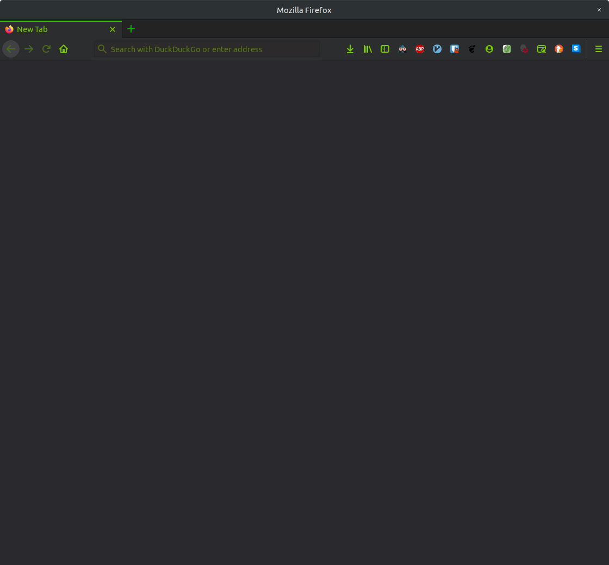
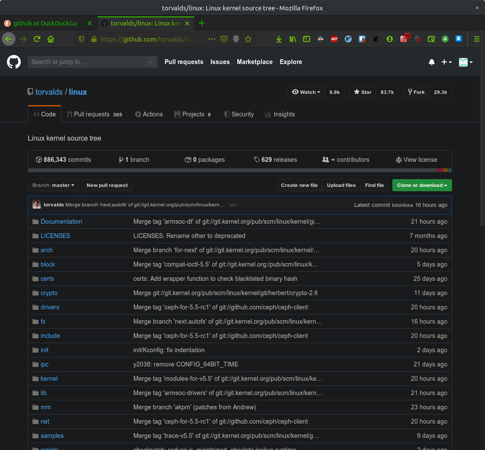

# Firefox 70(+?) Oriented for Privacy AbsDark&Green Theme, Prefs and Plugin List

## Disclaimer
* **I'AM NOT AN PRIVACY EXPERT** but rather an enthusiast. I've made this mainly for myself (theme and plugin list) and then decided to add some more information in case someone stumbles upon it.
* Antitracking is **VERY HARD**. Ongoing steps will make you *far less trackable* than average Joe, but this is definitely not a silver bullet. In case you are a journalist, whistleblower or you really need to be as sure as possible about your privacy (and, in that case, anonymity) **DON'T RELY** on these instructions and start here **https://tails.boum.org/about/index.en.html** and here **https://www.torproject.org/about/overview.html.en**.

### Preferences

* about:preferences#home
	- Web Search -> False
	- Top Sites -> False
	- Highlights -> False
	- Snippets -> False

* about:preferences#search
	- Default Search Engine -> DuckDuckGo
	- One-Click Search Engine -> DuckDuckGo

* about:preferences#privacy
	- Enhanced Tracking Protection -> Strict

### Enable DNS over HTTPS

* You can skip this if you are going to use tor DNS (Optional steps at the end)
* Firefox -> about:preferences#general -> Network Settings -> Check "Enable DNS over HTTPS"

### Disable Non-Default Fonts

* Firefox -> about:preferences#general > Fonts and Colors > Advanced
* Set Some Default System Font
* Uncheck "Allow pages to choose their own fonts, instead of your selections above"

### Consider disabling WEB-GL
 
 * Firefox -> about:config -> webgl.disabled = true
 * You can skip the WebGL Fingerprint Defender plugin

### Plugin List

Don't forget to setup Chameleon and Canvas Blocker, allow as much as you can afford, it might break some (maybe a lot of) websites. **Don't
Forget to Spoof the Screen Size** (Chameleon -> Options -> Script Injection -> Screen Size Spoofing).

* AdBlock Plus
* Chameleon
* Canvas Blocker
* WebGL Fingerprint Defender
* HTTPS Everywhere
* DuckDuckGo Privacy Essentials
* BitWarden
* Dark Reader
* Vimium
* Tabdetach
* Firefox Color

### Optional (anonymity) - Use tor proxy

* Check the link to tor website in the Disclaimer section for explanation what tor is and how to use and install it. Traffic routing via the tor network is generally way slower than typical internet connection.
* If you really need anonymity, consider using Tor Browser instead of Firefox. Many things (and much more) that we are solving here are set in Tor Browser by default.
* Run tor service
* Go to Firefox -> about:preferences#general -> Network Settings 
* Select "Manual proxy configuration"
* Socks Host = localhost
* Socks Port = 9050
* Select SOCKS v5
* **WARNING**: DNS requests and UDP traffic generally **ISN'T ROUTED VIA TOR NETWORK BY DEFAULT**
* Check if we are really connected via the tor network: https://check.torproject.org/

### Optional 2 (anonymity) - Resolve DNS via tor and minimize DNS leaks

* Set the tor DNSPort in tor config

        $ sudo echo "DNSPort 9055" >> /etc/tor/torrc  # or edit /etc/tor/torrc)        
        $ sudo service tor restart

* Check if DNS via tor works: 
    
        $ dig @127.0.0.1 -p 9055 torproject.com

* Either check Firefox -> about:preferences#general ->Network Settings -> "Proxy DNS when using SOCKS v5" or set your DNS server on your connection settings (or system) to 127.0.0.1:9055

### Check How Much Are We Trackable

Most of the fingerprint data is going to be spoofed, so don't be scared if you see high reported uniqueness and run the service few times to see the fingerprint data change. If it doesn't change enough, increase the entropy by allowing CanvasBlocker and Chameleon to do more work.

* https://panopticlick.eff.org/tracker
* https://amiunique.org/fp

### Theme

* Copy data/chrome/ to ~/.mozilla/firefox/*.default/chrome/

		$ cp -r ./data/chrome ~/.mozilla/firefox/$(ls ~/.mozilla/firefox/ | grep default | sed -r "s/\x1B\[([0-9]{1,2}(;[0-9]{1,2})?)?[mGK]//g")

* Firefox -> about:config -> toolkit.legacyUserProfileCustomizations.stylesheets = true
* Firefox -> Import data/simple_black_and_green.xpi (in case of import is bugged, use ./color_settings.png, gpick and Firefox Color plugin [Doh])
* Goto https://duckduckgo.com/settings#theme, choose 'Terminal'

### Screenshots

##### Empty (about:blank)

  

##### DuckDuckGo Search

  

##### Github Page

  

